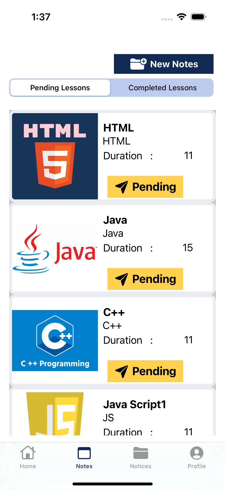
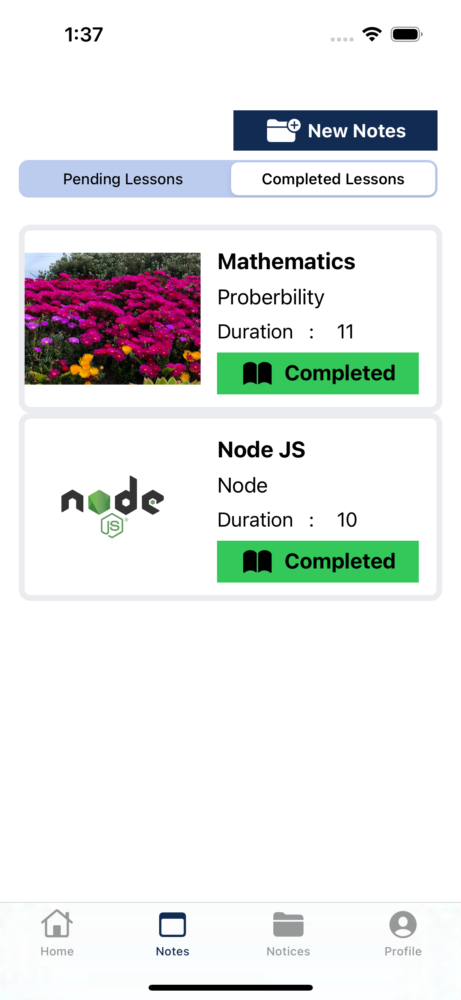
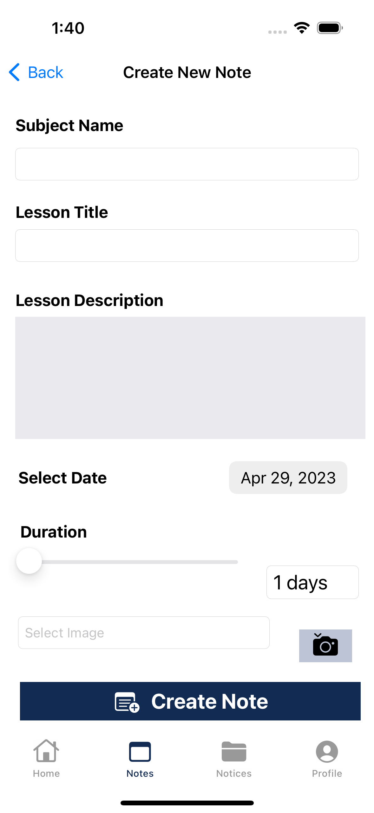
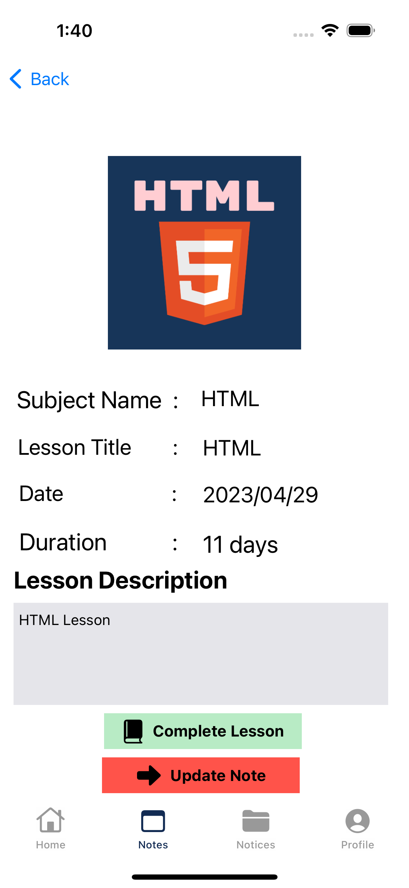
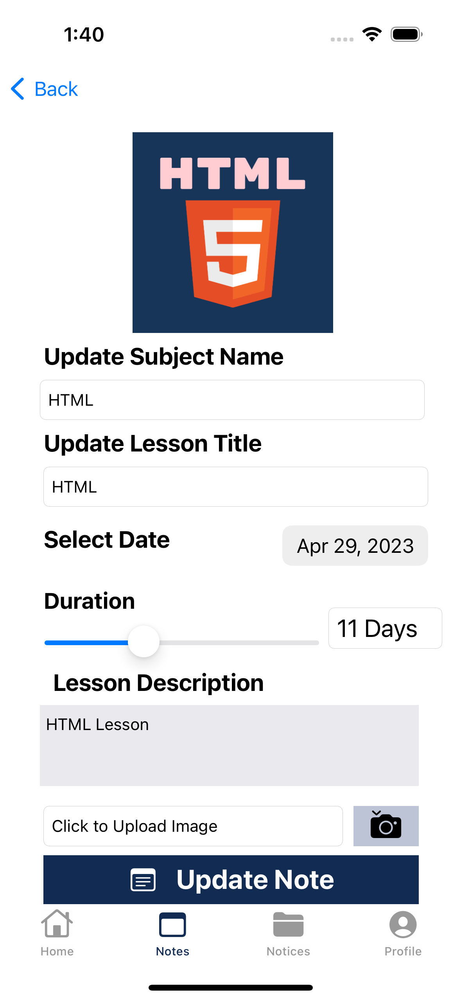
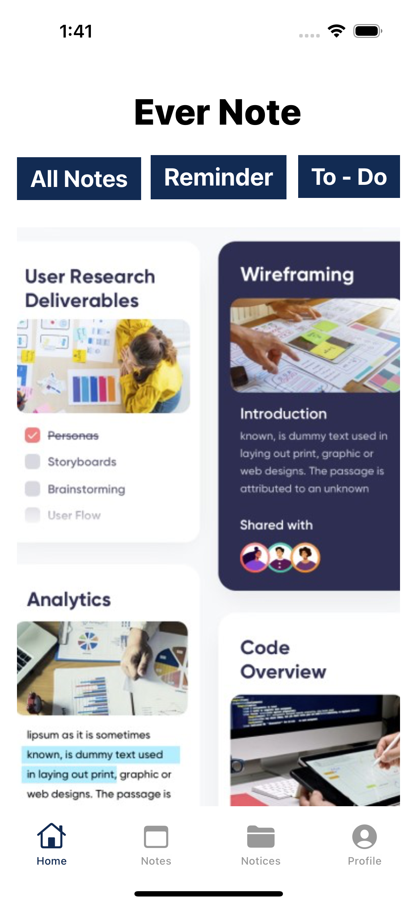

Please go under edit and edit this file as needed for your project.  There is no seperate documentation needed.

# Project Name - "Ever-Note" (student Subjects Notes Management App)
# Student Id - IT20130770
# Student Name - Gunarathna W.R.D

#### 01. Brief Description of Project - The Ever-Note mobile application is designed to be a student subjects notes management app that will help students keep track of their studied lessons and important points to remember. The app is aimed at providing students with an easy and convenient way to organize their notes and ensure that they do not forget any important information.

The main categories of the Ever-Note mobile application are "Completed Lessons" and "To Be Continued Lessons." The Completed Lessons category includes all the lessons that the student has completed. This category displays the subject name, subject title, a brief description of the lesson, and an image related to the lesson. This information can be easily accessed by the student to refresh their memory or review the material when needed.

The To Be Continued Lessons category allows students to keep track of their ongoing lessons. This section includes a list of the lessons that the student has yet to complete. The app also allows students to set reminders for each lesson so that they can stay on track with their studies.In addition to the two main categories, the Ever-Note mobile application also includes a search function. This feature allows students to quickly and easily find the notes they need by searching for specific keywords or phrases.

The Ever-Note mobile application is designed to be user-friendly and intuitive, with a clean and simple interface that is easy to navigate. It is available for both iOS and Android devices and can be downloaded from the App Store or Google Play Store. With Ever-Note, students can easily manage their notes and stay on top of their studies, ensuring that they are fully prepared for their exams and coursework.


#### 02. Users of the System - Students


#### 03. What is unique about your solution - The Ever-Note mobile application stands out from other note-taking and study management apps because of its focus on helping students manage their subject notes and studied lessons in a more organized and efficient way. Some of the unique features of this project include:

Completed and To Be Continued Lesson Categories: The Ever-Note app allows students to categorize their lessons into two main categories, completed and to be continued, to help them easily track their progress and review material when needed.

Lesson Images: The app also allows students to add images related to their lessons, making it easier to recall important information or visualize concepts that they may have trouble remembering.

Reminders: Students can set reminders for each lesson, which will help them stay on track with their studies and avoid missing any important deadlines or assignments.

Search Functionality: The Ever-Note app also includes a search function that allows students to quickly and easily find specific notes or lessons by searching for keywords or phrases.

User-Friendly Interface: The app's clean and simple interface is easy to navigate, making it accessible and user-friendly for students of all ages and academic levels.

Overall, the Ever-Note mobile application offers a unique set of features that make it a useful and practical tool for students who want to manage their subject notes and studied lessons more efficiently. By using this app, students can improve their study habits and ensure that they are fully prepared for exams and coursework.


#### 04. Briefly document the functionality of the screens you have (Include screen shots of images)

e.g. The first screen is used to capture a photo and it will be then processed for identifying the landmarks in the photo.

  

 
 
 
 
 

#### 05. Give examples of best practices used when writing code -

e.g The code below uses consistant naming conventions for variables, uses structures and constants where ever possible. (Elaborate a bit more on what you did)

```
  struct User {
    let firstName: String
    let lastName: String
    let age: Int
    let email: String?
    
    init(firstName: String, lastName: String, age: Int, email: String? = nil) {
        self.firstName = firstName
        self.lastName = lastName
        self.age = age
        self.email = email
    }
    
    func sendEmail(to recipient: String, subject: String, message: String) {
        guard let email = self.email else {
            print("Cannot send email. No email address on file.")
            return
        }
        
        // Code to send email goes here
        print("Sending email to \(recipient) from \(email) with subject: \(subject)")
        print("Message: \(message)")
    }
}
```

#### 06. UI Components used

e.g. The following components were used in the Landmark Identify App, UIButton, UIAlert, UIViewController, UINavigationController

#### 07. Testing carried out

e.g. The following classes implemented unit testing for the ```Landmark struct``` and ```Location struct```. 

```
    struct TestLandMarks {
       let name: String
```

#### 08. Documentation 


(a) Design Choices = When designing the Ever-Note mobile application, there are several design choices that need to be considered to ensure that the app meets the needs of its target audience - students. Some of the design choices that can be made are:

User Interface (UI) Design: The user interface of the Ever-Note mobile application should be designed to be simple, intuitive, and easy to use. The app should be visually appealing with clear and concise text, and easy-to-understand icons.

Color Scheme: The color scheme of the app should be chosen carefully to ensure that it is visually pleasing and easy on the eyes. Bright, bold colors can be used to draw attention to important information, while softer colors can be used for background elements.

Font Selection: The font used in the app should be legible and easy to read, even in small sizes. Sans-serif fonts are a good choice for digital interfaces because they are easy to read on screens of all sizes.

Navigation: The navigation within the app should be designed to be intuitive and easy to use. The main categories should be clearly labeled and easily accessible from anywhere in the app.

Responsiveness: The app should be responsive and work smoothly on different devices and screen sizes. It should be tested on various devices and platforms to ensure compatibility.


(b) Implementation Decisions = 
Using Xcode and Swift: The project will be developed using Xcode and Swift, as they are powerful and widely used tools for iOS development.
User interface design: The user interface will be designed using UIKit, which provides a set of pre-built user interface elements that can be used to build intuitive and visually appealing interfaces.
Database management: To manage the student notes data, a database will be implemented using CoreData. This will allow the application to store, retrieve, and manage the student notes data in a structured and efficient manner.
Segmented control: To implement the two main categories of notes (completed studied lessons,to be continoue lessons), a segmented control will be used. This control will allow the user to select the desired lesson catergory, which will then filter the lesson list accordingly.
Slider control: A slider control will be used to enable the user to select the time of they had studied that lesson.
Search bar: A search bar will be implemented to enable the user to search for specific lesson in the lesson list. This will provide a convenient way for users to find the lessons they need quickly and easily.
CRUD operations: The application will support CRUD (Create, Read, Update, Delete) operations for managing the student notes data. This will allow the user to add, view, edit, and delete lessons from the lesson list as needed.


(c) Challenges = The development of a mobile app like "Ever-Note" can present the developer with a number of obstacles. Challenges include time management, user interface design, issue fixing, debugging, and a lack of familiarity with programming tools like Xcode, Swift, and UIKit.A developer may need to put in extra time learning how to make the most of development tools in order to get beyond the barrier of inadequate familiarity with those tools. You can achieve this by consulting resources like manuals and tutorials, or by reaching out to seasoned programmers for advice.

The success of a mobile app is directly proportional to how well its UI is designed. To build a user-friendly and straightforward interface that is tailored to the user's demands, a developer needs to have strong design abilities and an understanding of UI best practises. This may involve looking into current trends in user interface design, testing the design with real people, and iterating until the design is perfect.The software development process sometimes encounters the time-consuming and irritating task of debugging bugs. To ensure the correct operation of the programme, a developer may need to spend additional time thoroughly analysing their code, discovering problems, and repairing them.

Developing a mobile app requires careful time management, especially if you already have other commitments. A developer's time is valuable, so it's important for them to construct a project plan with hard deadlines, assign priorities, and build in downtime to prevent burnout. This helps make sure they can devote sufficient time to the job without letting other things slide.The development of a mobile app like "My Tasks" can present the developer with a number of obstacles. Challenges include time management, user interface design, issue fixing, debugging, and a lack of familiarity with programming tools like Xcode, Swift, and UIKit.

 A developer may need to put in extra time learning how to make the most of development tools in order to get beyond the barrier of inadequate familiarity with those tools. You can achieve this by consulting resources like manuals and tutorials, or by reaching out to seasoned programmers for advice.The success of a mobile app is directly proportional to how well its UI is designed. To build a user-friendly and straightforward interface that is tailored to the user's demands, a developer needs to have strong design abilities and an understanding of UI best practises. This may involve looking into current trends in user interface design, testing the design with real people, and iterating until the design is perfect.

 The software development process sometimes encounters the time-consuming and irritating task of debugging bugs. To ensure the correct operation of the programme, a developer may need to spend additional time thoroughly analysing their code, discovering problems, and repairing them.Developing a mobile app requires careful time management, especially if you already have other commitments. A developer's time is valuable, so it's important for them to construct a project plan with hard deadlines, assign priorities, and build in downtime to prevent burnout. This helps make sure they can devote sufficient time to the job without letting other things slide.

#### 09. Reflection

Challenges that you faced in doing the assingment (other than know technical issues of getting hold of a proper Mac machine).
How would have approached this Assignment differently

  

